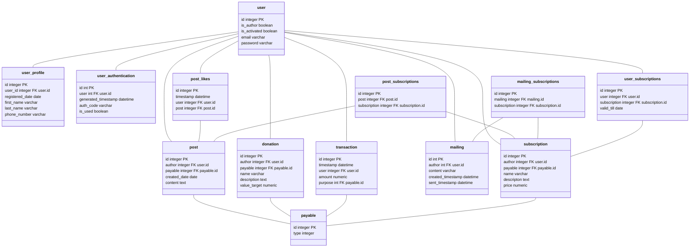

```mermaid
classDiagram  

 class user {  
  id integer PK
  is_author boolean
  is_activated boolean
  email varchar
  password varchar
 }  
 
 class user_profile {
  id integer PK
  user_id integer FK user.id
  registered_date date
  first_name varchar
  last_name varchar
  phone_number varchar
}

 class user_authentication {
  id int PK
  user int FK user.id
  generated_timestamp datetime
  auth_code varchar
  is_used boolean
}

 class subscription {
  id integer PK
  author integer FK user.id
  payable integer FK payable.id
  name varchar
  descripton text
  price numeric
}

 class user_subscriptions {
  id integer PK
  user integer FK user.id
  subscription integer FK subscription.id
  valid_till date
}

 class post {
  id integer PK
  author integer FK user.id
  payable integer FK payable.id
  created_date date
  content text
}

 class post_subscriptions {
  id integer PK
  post integer FK post.id
  subscription integer FK subscription.id
}

 class post_likes {
  id integer PK
  timestamp datetime
  user integer FK user.id
  post integer FK post.id
}

 class donation {
  id integer PK
  author integer FK user.id
  payable integer FK payable.id
  name varchar
  description text
  value_target numeric
}

class mailing {
  id int PK
  author int FK user.id
  content varchar
  created_timestamp datetime
  sent_timestamp datetime
}

class mailing_subscriptions {
  id integer PK
  mailing integer FK mailing.id
  subscription integer FK subscription.id
}

class transaction {
  id integer PK
  timestamp datetime
  user integer FK user.id
  amount numeric
  purpose int FK payable.id
}

class payable {
  id integer PK
  type integer
}


 user -- user_authentication
 user -- user_profile
 user -- subscription
 user -- post
 user -- post_likes
 user -- transaction
 user -- user_subscriptions
 user -- donation
 user -- mailing

 post_likes -- post

 post_subscriptions -- post
 post_subscriptions -- subscription

 mailing_subscriptions -- mailing
 mailing_subscriptions -- subscription

 user_subscriptions -- subscription
 
 post -- payable
 donation -- payable
 transaction -- payable
 subscription -- payable

```

